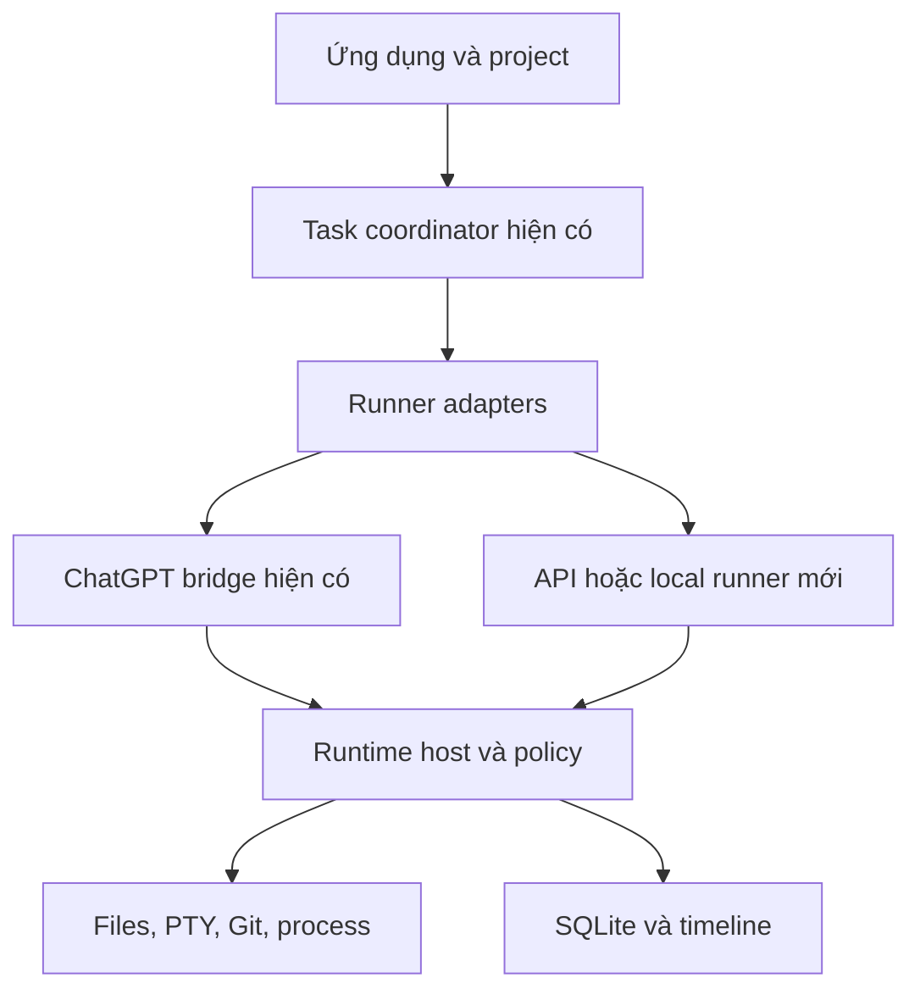

# ChatCMD → Son Agent Studio: audit source và kế hoạch V1

Ngày: 04/10/2026. Tên Son Agent Studio là tên làm việc, chưa phải quyết định thương hiệu.
Repository: https://github.com/sonnguyen8704/ChatCmd
Baseline đã kiểm tra: `e604ac8cb53322082887f97efdcdd647193de768` trên `main`.

## 1. Kết luận và giới hạn kiểm chứng

Có thể dùng fork làm nền tảng phát triển ứng dụng riêng. Nên bắt đầu bằng bản cá nhân chạy trên Mac Apple Silicon, giữ MCP runtime và ChatGPT bridge hiện có; xây chế độ API sau khi bootstrap ổn định.

Đây là audit kiến trúc và một số luồng source trọng yếu, không phải kiểm toán bảo mật toàn bộ hay xác nhận mọi feature hoạt động. Đã đọc manifest, hướng dẫn phát triển, kiến trúc, routing, startup, updater, packaging, access profiles, runtime/sub-agent và các thành phần storage liên quan; đối chiếu những điểm quan trọng với source. Chưa build Rust hoặc chạy ứng dụng trên Mac.

Kiểm chứng:
- Clone fork thành công, xác định baseline nêu trên.
- `node --test content-chatgpt.test.cjs` trong `chatgpt-extension/`: 33/33 tests pass.
- Môi trường audit có Node 24.19.0, không có `cargo`; chưa chạy Rust check/test/Clippy.
- Chưa kiểm thử DOM trên ChatGPT đang đăng nhập; unit tests không thay thế bước này.
- Chưa audit giấy phép từng dependency. MIT của repository không tự động bao phủ mọi dependency.

## 2. Những gì đã có, không cần xây lại

| Năng lực | Source hiện có | Quyết định |
| --- | --- | --- |
| Domain/contract và identity | `crates/chatcmd-core/` | Giữ |
| SQLite, migration, recovery | `crates/chatcmd-storage/` | Giữ, migration mới phải append-only |
| File, search, edit, Git, PTY, process, policy | `crates/chatcmd-runtime/src/` | Giữ |
| MCP catalog, identity, HTTP và sampling | `crates/chatcmd-mcp/src/` | Giữ protocol và kiểm tra quyền |
| Task, approval, cancellation, orchestration | `src/runtime_host/` | Giữ, mở rộng có giới hạn |
| Quản lý project | `src/api/workspaces.rs`, `web/src/tasks/workspaceProjects.ts` | Dùng lại |
| MCP access profiles | `src/api/agents.rs`, `web/src/pages/AgentsPage.tsx` | Dùng lại, phân biệt với persona |
| Skills | `src/api/skills.rs`, `crates/chatcmd-runtime/src/skill_service.rs`, `web/src/pages/SkillsPage.tsx` | Dùng lại |
| ChatGPT, queue và compact | `src/api/chatgpt*.rs`, `src/chatgpt_queue.rs`, `crates/chatcmd-storage/src/compact/` | Giữ adapter hiện có |
| Sub-agent lifecycle và watchdog | `src/runtime_host/subagents.rs` và thư mục con | Giữ; không đồng nghĩa model runner API độc lập |
| Giao diện React, live events, terminal | `web/src/`, `src/websocket/` | Tái sử dụng |
| Đóng gói desktop | `scripts/build-macos.sh`, `scripts/build-windows.ps1` | Điều chỉnh nhận diện và release |

Không xóa module ở V1. Các phần chưa dùng được ẩn khỏi onboarding hoặc để tùy chọn nhằm giảm độ lệch upstream.

## 3. Các phát hiện cần giải quyết trước bản riêng

### P0 — Updater vẫn trỏ upstream

`src/updater/github.rs` có `LATEST_RELEASE_URL = https://api.github.com/repos/int04/ChatCMD/releases/latest`.
`src/updater/install.rs` chuẩn bị thay executable/app bundle hiện tại.

Hệ quả: nếu dùng chức năng update của bản fork mà chưa chỉnh nguồn, có thể cài lại release upstream và mất bản tùy biến. V1 phải đổi nguồn release về fork và kiểm thử trạng thái chưa có release. URL tải cần được ràng buộc với repository/asset mong đợi, không chỉ hostname GitHub.

Tiêu chí: không có request update đến upstream; repo fork chưa có release không gây crash; payload sai repo/architecture/checksum bị từ chối. Chưa có release hợp lệ thì không triển khai auto-update.

### P0 — Tách runtime và dữ liệu

Startup đã hỗ trợ `CHATCMD_PORT`, `CHATCMD_DB_PATH`, `CHATCMD_WEB_DIST`; log override được mô tả trong DEVELOPMENT.
Dùng riêng database/log/port cho stable và candidate. Không cho candidate mở database stable: startup recovery và migration có thể thay đổi dữ liệu đang dùng.

Chỉ giới hạn folder trong MCP chưa đủ để khẳng định sandbox OS: shell được cấp quyền rộng vẫn có thể truy cập ngoài folder. Cần review policy/command grants và, nếu muốn cưỡng chế mạnh, dùng OS account hoặc sandbox riêng. V1 cá nhân phải diễn đạt đúng mức bảo vệ thực tế.

### P1 — Tài liệu transport mâu thuẫn

`docs/ARCHITECTURE.md` vừa mô tả ECDH/AES-GCM, vừa nói JSON thường.
`docs/ENCRYPTION_PROTOCOL.md` và client/API hiện tại mô tả lớp crypto tùy chỉnh đã bỏ.

Sửa tài liệu theo implementation. Caller marker không phải bí mật xác thực; phải giữ GUI auth, route authorization và origin/loopback controls. Không quảng bá quản lý API là mã hóa riêng khi không còn cơ chế đó.

### P1 — Nhận diện sản phẩm và phân phối

`scripts/build-macos.sh` vẫn dùng ChatCMD.app, `com.chatcmd.client`, icon và mặc định signing identity của tác giả. Cargo/package metadata vẫn trỏ upstream.
Script hiện tạo ZIP chứa .app và extension, chưa tạo DMG.

Phải có bundle ID, data namespace, icon, repo/release và signing identity riêng. Không chỉ thay chữ trong UI; không đổi hàng loạt tên crate hoặc protocol ngay ở V1. Giữ bản quyền MIT và ghi rõ fork/upstream.

### P1 — Access profile khác Agent Profile

Trang Agents hiện chủ yếu quản lý token và quyền MCP. Persona như Coding/Solar/Video là cấu hình tác vụ gồm instruction, skills và lựa chọn runner, không phải thay thế authority.

Persona chỉ được đề nghị quyền; quyền thực tế do access profile và policy xác định. Đổi persona/model không được làm tăng quyền.

### P2 — Browser bridge và API mode là hai runner khác nhau

ChatGPT extension là adapter DOM; sub-agent sampling phụ thuộc client/bridge. Không mặc định rằng ChatCMD đã có vòng lặp agent cho OpenAI/Anthropic/Ollama chỉ vì có MCP và sub-agent.

API mode cần implementation mới: model streaming, tool-call loop, cancellation, timeout, quota, persistence, error recovery. V1 cá nhân vẫn dùng runner hiện có; API mode là milestone riêng.

## 4. Kiến trúc đích

API runner phải đi qua cùng authority/policy với MCP runner, không gọi thẳng shell để bỏ qua approval. Giữ task ID độc lập với provider conversation ID; compact/resume cần adapter có capability rõ ràng.

## 5. Phạm vi V1

V1: ứng dụng cá nhân trên MacBook M4 Pro, project/workspace, MCP profiles, ChatGPT connection, tasks, skills, terminal/Git, isolated candidate và đóng gói .app.

Chưa đưa vào V1: billing, license server, đồng bộ cloud, marketplace, nhiều user và agent tự động phát hành phiên bản. API mode được chuẩn bị kiến trúc nhưng không chặn việc thử bootstrap.

User flow:
1. Mở app, chọn thư mục project.
2. Tạo/chọn access profile và kết nối client bằng cơ chế hiện có.
3. Chạy tác vụ đọc source đầu tiên, xác nhận workspace và quyền.
4. Giao sửa một thay đổi nhỏ trên branch; xem diff và kết quả kiểm tra.
5. Build candidate riêng, chạy bằng database/port riêng.
6. Người dùng chọn phiên bản thay thế stable sau khi đã kiểm chứng.

Không giả định rằng nối extension là đã nối MCP; kiểm thử hai luồng riêng. Cloud MCP client không truy cập được loopback của Mac nếu chưa có đường kết nối từ client, chẳng hạn HTTPS tunnel cấu hình đúng. Không expose management API rộng chỉ để nối MCP.

## 6. Backlog theo thứ tự triển khai

| Mốc | Thay đổi và file/module | Điều kiện hoàn thành |
| --- | --- | --- |
| M0 Baseline | Clone, build/test hiện trạng; branch riêng; record toolchain | Biết test nào pass/fail trước tùy biến; app mở được trên Mac |
| M1 Fork identity | `src/updater/github.rs`, `src/updater/model.rs`, `scripts/build-macos.sh`, `crates/chatcmd-storage/src/path.rs`, Cargo/web metadata, i18n | Update chỉ từ fork, bundle/data riêng, MIT giữ nguyên |
| M2 Bootstrap isolation | Script launcher mới; dùng env startup; hướng dẫn stable/candidate | Hai instance chạy đồng thời, không dùng chung DB; candidate lỗi không làm stable ngừng |
| M3 Onboarding | `web/src/App.tsx`, page mới; reuse `api.ts` và workspaces/access profiles | Project + profile + connection check + read-only task đầu tiên |
| M4 Agent Profiles | Domain/storage/API/UI mới; liên kết skills và access profile | Persona không tăng quyền; validate skill/provider reference; không lưu secrets trong persona |
| M5 Candidate workflow | Build manifest và smoke checklist; CI của fork | Diff + baseline SHA + test results + artifact digest truy vết được |
| M6 Optional API runner | Runner interface và một provider trước, sau đó local | Streaming/tool/cancel/error đều đi qua task/policy hiện có |

Các module M4/M6 sau đây là đề xuất mới, chưa tồn tại:
- `src/agent_profiles/`: validation và cấu hình persona.
- `src/api/agent_profiles.rs`: CRUD qua local API, đăng ký trong `src/api/routes.rs`.
- `web/src/pages/AgentProfilesPage.tsx`: UI persona tách access profile.
- `src/agent_runner/`: Runner trait và adapters; đặt capability flags cho tools/streaming/resume.
- `src/api/providers.rs`, `web/src/pages/ProvidersPage.tsx`: cấu hình provider.
- Migration mới dưới `crates/chatcmd-storage/migrations/`: chọn số tiếp theo tại lúc implementation, không hard-code từ kế hoạch.

Thiết kế dữ liệu:
- agent_profiles: id, name, instructions, skill references, access_profile_id, optional provider_config_id, revision.
- provider_configs: id, kind, endpoint, model, credential_reference, limits.
- Credentials: dùng OS keychain; SQLite lưu reference, không đưa key vào timeline/export.
- Build manifest: source SHA, version, platform, artifact SHA-256, validation summary.
- Project memory V1: file có version trong workspace và handoff task hiện có; chưa cần vector database.

## 7. Dùng ChatCMD để phát triển chính nó

Bố trí đề xuất trên Mac:
- `~/SonAgent/stable/`: app đang phục vụ MCP.
- `~/SonAgent/workspace/ChatCmd/`: checkout để sửa.
- `~/SonAgent/builds/candidate/`: candidate artifacts.
- `~/SonAgent/data/stable/`, `~/SonAgent/data/candidate/`: dữ liệu riêng.
- `~/SonAgent/backups/`: bản sao phục hồi có version.

Stable dùng port 8080; candidate dùng 8081 hoặc port trống khác. Extension hiện có có giả định loopback/port nên phải kiểm tra cấu hình callback cho candidate; env đổi port không tự bảo đảm extension theo port mới.

Quy trình:
1. Stable phục vụ agent; agent sửa checkout trên branch.
2. Chạy checks đúng với phạm vi sửa và baseline.
3. Build candidate vào vị trí riêng; không đè app đang chạy.
4. Smoke candidate bằng DB mới hoặc bản sao dữ liệu đã snapshot an toàn.
5. Dừng candidate, xác nhận diff/artifact và kế hoạch migration.
6. Khi người dùng chọn nâng cấp: dừng stable, snapshot nhất quán SQLite, thay app, mở và kiểm tra.
7. Rollback cả binary và snapshot dữ liệu tương thích nếu migration mới không backward-compatible.

Không copy file .db đơn lẻ khi WAL đang hoạt động. Dùng SQLite backup API hoặc dừng instance trước khi snapshot. Không hứa rollback bằng binary cũ sẽ đọc được schema mới.
Không coi source runtime là tự bảo vệ: stable isolation là bố trí vận hành và policy cần kiểm chứng, không là sandbox vật lý sẵn có.

## 8. Kiểm thử và phát hành

Rust: `cargo fmt --all -- --check`, `cargo check --workspace --all-targets`, `cargo test --workspace`, `cargo clippy --workspace --all-targets -- -D warnings`.
Web: trong web, `npm ci`, `npm run lint`, `npm test -- --run`, `npm run build`.
Extension: 33 tests hiện pass; manual test start/continue/stop/queue/compact trên tab đăng nhập riêng.
Mac: build Apple Silicon và smoke tray, folder picker, PTY, permissions, restart, candidate port và update failure.

Đóng gói cá nhân có thể ad-hoc signing; phân phối công khai cần signing/notarization riêng và kiểm tra dependency notices. Không dùng chứng chỉ tác giả upstream. DMG là deliverable mới nếu cần.

Fork hiện chỉ có main và test/chatgpt-write-access trong refs được clone. Hướng dẫn upstream đề nghị PR vào dev nhưng fork chưa có dev; PR tài liệu này vào main để review, không merge tự động. Có thể lập dev cho implementation sau.

## 9. Đề xuất công việc tiếp theo

Triển khai M0–M2 trước: chứng minh bản nguyên gốc chạy được trên Mac, tách release/data identity, rồi dựng candidate độc lập. Chỉ sau đó mới chỉnh onboarding/persona và thêm API runner.

Chưa có code sản phẩm được thay đổi trong audit này. Chưa kết nối máy Mac của người dùng hoặc thực hiện self-development qua ChatCMD local. Tài liệu là kế hoạch triển khai có source references và acceptance criteria, không phải tuyên bố ứng dụng V1 đã hoàn tất.
